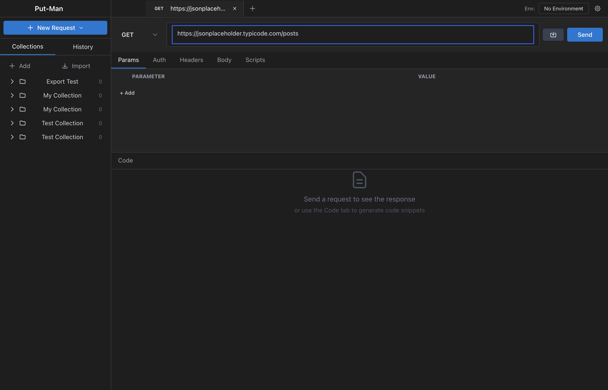

# Put-Man

A privacy-respecting, open-source API client for macOS. A modern alternative to Postman that keeps your data local.

  



## Features

### Core Features
- **HTTP Client** - Full support for GET, POST, PUT, PATCH, DELETE, HEAD, OPTIONS
- **Request Builder** - Query parameters, headers, body (JSON, Form Data, x-www-form-urlencoded, Raw, Binary)
- **Response Viewer** - Pretty-printed JSON/XML, raw view, tree view, response headers, cookies
- **Collections** - Organize requests into collections and folders with drag-and-drop support
- **Environments** - Create multiple environments with variables, switch between them easily
- **History** - Automatic request history with search and filtering

### Advanced Features
- **Pre-request & Test Scripts** - JavaScript scripting with Postman-compatible `pm` API
- **Request Chaining** - Variables set in scripts automatically persist to environments
- **WebSocket Support** - Connect, send messages, view real-time responses
- **Server-Sent Events (SSE)** - Subscribe to SSE endpoints with live event streaming
- **GraphQL Support** - Query editor with variables, schema introspection
- **Authentication** - Basic Auth, Bearer Token, API Key, OAuth 2.0 (Client Credentials)
- **Code Generation** - Export requests as cURL, JavaScript (Fetch/Axios), Python, Go, PHP
- **Import/Export** - Full Postman Collection v2.1 compatibility
- **Native macOS Menu** - Full menu bar with keyboard shortcuts for all actions

### Privacy & Security
- **100% Local** - All data stored locally in SQLite, never sent to external servers
- **No Account Required** - No sign-up, no telemetry, no tracking
- **Open Source** - Fully auditable codebase

## Installation

### From Release
Download the latest `.dmg` from the [Releases](https://github.com/your-repo/put-man/releases) page.

### From Source
```bash
# Clone the repository
git clone https://github.com/your-repo/put-man.git
cd put-man

# Install dependencies
npm install

# Run in development mode
npm run dev

# Build for production
npm run build

# Package for macOS
npm run package:mac
```

## Usage

### Making Requests
1. Click **New Request** or press `Cmd+T`
2. Select HTTP method (GET, POST, etc.)
3. Enter the URL
4. Add query parameters, headers, or body as needed
5. Click **Send** or press `Cmd+Enter`

### Using Environments
1. Click the gear icon next to the environment selector
2. Create a new environment (e.g., "Development", "Production")
3. Add variables (e.g., `BASE_URL`, `API_KEY`)
4. Use variables in requests with `{{variable_name}}` syntax

### Writing Scripts
Pre-request and test scripts use a Postman-compatible API:

```javascript
// Pre-request script - runs before the request
pm.environment.set("timestamp", Date.now());

// Test script - runs after the response
pm.test("Status is 200", function() {
    pm.response.to.have.status(200);
});

pm.test("Response has data", function() {
    const json = pm.response.json();
    pm.expect(json.data).to.exist;
});

// Chain requests by extracting values
const token = pm.response.json().access_token;
pm.environment.set("auth_token", token);
```

### WebSocket Connections
1. Right-click the **+** tab button and select **WebSocket**
2. Enter the WebSocket URL (ws:// or wss://)
3. Click **Connect**
4. Send and receive messages in real-time

### Importing Postman Collections
1. Click **Import** in the Collections sidebar
2. Select a Postman Collection JSON file (v2.1 format)
3. The collection with all requests and folders will be imported

## Keyboard Shortcuts

| Action | Shortcut |
|--------|----------|
| New Request | `Cmd+T` |
| New Collection | `Cmd+Shift+N` |
| Close Tab | `Cmd+W` |
| Send Request | `Cmd+Enter` |
| Duplicate Tab | `Cmd+D` |
| Switch Tabs | `Cmd+1-9` |
| Import | `Cmd+I` |
| Export | `Cmd+E` |

## Technical Details

### Architecture
- **Frontend**: React 18 + TypeScript + Tailwind CSS
- **Backend**: Electron 28 (Main Process)
- **Database**: SQLite via better-sqlite3
- **State Management**: Zustand
- **Code Editor**: Monaco Editor
- **Build Tool**: electron-vite

### Data Storage
All data is stored locally at:
```
~/Library/Application Support/put-man/data/put-man.db
```

### Project Structure
```
src/
├── main/           # Electron main process
│   ├── database/   # SQLite initialization & repositories
│   ├── ipc/        # IPC handlers
│   └── services/   # HTTP, WebSocket, SSE, Scripts, etc.
├── preload/        # Electron preload scripts
├── renderer/       # React frontend
│   ├── components/ # UI components
│   └── stores/     # Zustand stores
└── shared/         # Shared types
```

## Development

### Prerequisites
- Node.js 18+
- npm 9+
- macOS (for native module compilation)

### Scripts
```bash
npm run dev           # Start development server
npm run build         # Build for production
npm run test:run      # Run unit tests
npm run test:e2e      # Run E2E tests (headless)
npm run test:e2e:visible  # Run E2E tests (visible window)
npm run typecheck     # TypeScript type checking
npm run lint          # ESLint
npm run package:mac   # Package for macOS
```

### Testing
- **Unit Tests**: Vitest with React Testing Library (122 tests)
- **E2E Tests**: Playwright for Electron (50+ test cases)

```bash
# Run all unit tests
npm run test:run

# Run E2E tests (headless, won't steal focus)
npm run test:e2e

# Run specific E2E tests
HEADLESS=1 npx playwright test --grep "Collections"
```

## Contributing
Contributions are welcome! Please read the contributing guidelines before submitting PRs.

1. Fork the repository
2. Create a feature branch (`git checkout -b feature/amazing-feature`)
3. Commit your changes (`git commit -m 'Add amazing feature'`)
4. Push to the branch (`git push origin feature/amazing-feature`)
5. Open a Pull Request

## License
MIT License - see [LICENSE](LICENSE) for details.

## Acknowledgments
- Inspired by [Postman](https://postman.com) and [Insomnia](https://insomnia.rest)
- Built with [Electron](https://electronjs.org), [React](https://reactjs.org), and [Tailwind CSS](https://tailwindcss.com)
- Icons from [Heroicons](https://heroicons.com)
